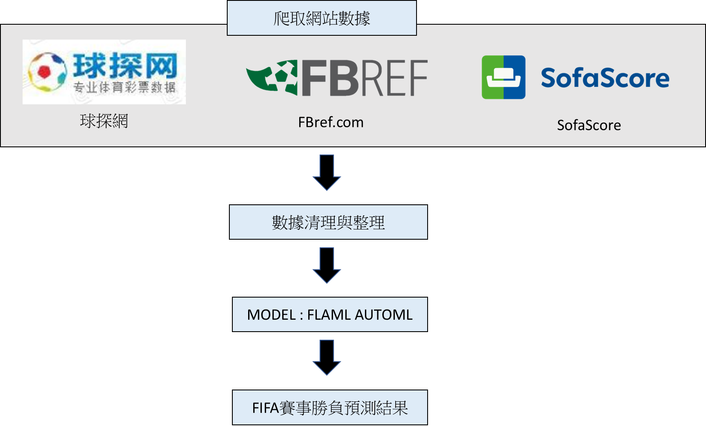

# Guess365 FIFA預測機器人
製作日期 : 2022/10~2022/12  
製作人 : Rick  
## 功能介紹與工具:
### (一)	功能介紹
本專案利用大量歷史FIFA(世界盃足球賽)賽事數據，搭配機器學習、深度學習等方式，進行比賽勝負之預測。  
歷史資料年份 : 2002~2021賽季(只要是世界等級的比賽都當作訓練集)  
實測年份 : 2022賽季  
模型 :  FIFA AUTOML  
執行檔:  
-	FIFA_FLAML_PREDICT.py : 前一日晚上8點執行模型並發送賽事預測推播
### (二)	使用工具與套件
-	Python3.9.12(Jupyter Notbook)
-	beautifulsoup4  4.12.2
-	lxml   4.9.2
-	pyquery 2.0.0
-	selenium 4.8.0
-	requests  2.29.0
-	pandas  1.5.3
-	joblib 1.1.1
-	json   0.9.6
-	pickleshare 0.7.5
-	keras 2.8.0
-	tensorflow  2.8.0
## 系統流程
### 一、	架構圖
透過爬取網路上FIFA相關網站之資訊，並整理與統整數據後，組成數據集，並搭配FIFA AUTOML模型進行賽事預測之運用。  
   


## 模組元件功能說明
### 一、	特徵值
| 特徵名稱 |  介紹   |
|---------|---------|
|Game| 	賽事類別(數值標籤化)|
|Weather| 當天天氣狀況(數值標籤化)|
|Temperature| 當天溫度|
|Home_進球數初盤| 球探網中主隊進球數賠率(初盤)|
|進球數初盤| 球探網中進球數的分水嶺(初盤)|
|Away_進球數初盤| 球探網中客隊進球數賠率(初盤)|
|Home_進球數終盤| 球探網中主隊進球數賠率(終盤)|
|進球數終盤| 球探網中進球數的分水嶺(終盤)|
|Away_進球數終盤| 球探網中客隊進球數賠率(終盤)|
|Home_角球|	主隊平均角球數(歷史至今)|
|Away_角球|	客隊平均角球數(歷史至今)|
|Home_半場角球|	主隊平均半場角球數(歷史至今)|
|Away_半場角球|	客隊平均半場角球數(歷史至今)|
|Home_黃牌|	主隊平均黃牌數(歷史至今)|
|Away_黃牌|	客隊平均黃牌數(歷史至今)|
|Home_射門|	主隊平均射門數 (歷史至今)|
|Away_射門|	客隊平均射門數 (歷史至今)|
|Home_射正|	主隊平均射正數 (歷史至今)|
|Away_射正|	客隊平均射正數 (歷史至今)|
|Home_進攻|	主隊平均進攻數 (歷史至今)|
|Away_進攻|	客隊平均進攻數 (歷史至今)|
|Home_危險進攻|	主隊平均危險進攻數 (歷史至今)|
|Away_危險進攻|	客隊平均危險進攻數 (歷史至今)|
|Home_射門不中|	主隊平均射門不中數 (歷史至今)|
|Away_射門不中|	客隊平均射門不中數 (歷史至今)|
|Home_控球率|	主隊平均控球率 (歷史至今)|
|Away_控球率|	客隊平均控球率 (歷史至今)|
|Home_半場控球率|	主隊平均半場控球率 (歷史至今)|
|Away_半場控球率|	客隊平均半場控球率 (歷史至今)|
|Home_角球_inhome|	主隊平均主場角球數(歷史至今)|
|Away_角球_inhome|	客隊平均主場角球數(歷史至今)|
|Home_半場角球_inhome|	主隊平均主場半場角球數(歷史至今)|
|Away_半場角球_inhome|	客隊平均主場半場角球數(歷史至今)|
|Home_黃牌_inhome|	主隊平均主場黃牌數(歷史至今)|
|Away_黃牌_inhome|	客隊平均主場黃牌數(歷史至今)|
|Home_射門_inhome|	主隊平均主場射門數 (歷史至今)|
|Away_射門_inhome|	客隊平均主場射門數 (歷史至今)|
|Home_射正_inhome|	主隊平均主場射正數 (歷史至今)|
|Away_射正_inhome|	客隊平均主場射正數 (歷史至今)|
|Home_進攻_inhome|	主隊平均主場進攻數 (歷史至今)|
|Away_進攻_inhome|	客隊平均主場進攻數 (歷史至今)|
|Home_危險進攻_inhome|	主隊平均主場危險進攻數 (歷史至今)|
|Away_危險進攻_inhome|	客隊平均主場危險進攻數 (歷史至今)|
|Home_射門不中_inhome|	主隊平均主場射門不中數 (歷史至今)|
|Away_射門不中_inhome|	客隊平均主場射門不中數 (歷史至今)|
|Home_控球率_inhome|	主隊平均主場控球率 (歷史至今)|
|Away_控球率_inhome|	客隊平均主場控球率 (歷史至今)|
|Home_半場控球率_inhome|	主隊平均主場半場控球率 (歷史至今)|
|Away_半場控球率_inhome|	客隊平均主場半場控球率 (歷史至今)|
|Home_角球_inaway|	主隊平均客場角球數(歷史至今)|
|Away_角球_inaway|	客隊平均客場角球數(歷史至今)|
|Home_半場角球_inaway|	主隊平均客場半場角球數(歷史至今)|
|Away_半場角球_inaway|	客隊平均客場半場角球數(歷史至今)|
|Home_黃牌_inaway|	主隊平均客場黃牌數(歷史至今)|
|Away_黃牌_inaway|	客隊平均客場黃牌數(歷史至今)|
|Home_射門_inaway|	主隊平均客場射門數 (歷史至今)|
|Away_射門_inaway|	客隊平均客場射門數 (歷史至今)|
|Home_射正_inaway|	主隊平均客場射正數 (歷史至今)|
|Away_射正_inaway|	客隊平均客場射正數 (歷史至今)|
|Home_進攻_inaway|	主隊平均客場進攻數 (歷史至今)|
|Away_進攻_inaway|	客隊平均客場進攻數 (歷史至今)|
|Home_危險進攻_inaway|	主隊平均客場危險進攻數 (歷史至今)|
|Away_危險進攻_inaway|	客隊平均客場危險進攻數 (歷史至今)|
|Home_射門不中_inaway|	主隊平均客場射門不中數 (歷史至今)|
|Away_射門不中_inaway|	客隊平均客場射門不中數 (歷史至今)|
|Home_控球率_inaway|	主隊平均客場控球率 (歷史至今)|
|Away_控球率_inaway|	客隊平均客場控球率 (歷史至今)|
|Home_半場控球率_inaway|	主隊平均客場半場控球率 (歷史至今)|
|Away_半場控球率_inaway|	客隊平均客場半場控球率 (歷史至今)|
|Home_進球(近3場)|	主隊近3場進球數|
|Away_進球(近3場)|	客隊近3場進球數|
|Home_失球(近3場)|	主隊近3場失球數|
|Away_失球(近3場)|	客隊近3場失球數|
|Home_被射門(近3場)|	主隊近3場被射門數|
|Away_被射門(近3場)|	客隊近3場被射門數|
|Home_角球(近3場)|	主隊近3場角球數|
|Away_角球(近3場)|	客隊近3場角球數|
|Home_黃牌(近3場)|	主隊近3場黃牌數|
|Away_黃牌(近3場)|	客隊近3場黃牌數|
|Home_犯規(近3場)|	主隊近3場犯規數|
|Away_犯規(近3場)|	客隊近3場犯規數|
|Home_控球率(近3場)|	主隊近3場控球率|
|Away_控球率(近3場)|	客隊近3場控球率|
|Home_進球(近10場)|	主隊近10場進球數|
|Away_進球(近10場)|	客隊近10場進球數|
|Home_失球(近10場)|	主隊近10場失球數|
|Away_失球(近10場)|	客隊近10場失球數|
|Home_被射門(近10場)|	主隊近10場被射門數|
|Away_被射門(近10場)|	客隊近10場被射門數|
|Home_角球(近10場)|	主隊近10場角球數|
|Away_角球(近10場)|	客隊近10場角球數|
|Home_黃牌(近10場)|	主隊近10場黃牌數|
|Away_黃牌(近10場)|	客隊近10場黃牌數|
|Home_犯規(近10場)|	主隊近10場犯規數|
|Away_犯規(近10場)|	客隊近10場犯規數|
|Home_控球率(近10場)|	主隊近10場控球率|
|Away_控球率(近10場)|	客隊近10場控球率|
|Home_進球率(15m)|	主隊近30場(0~15分鐘)進球率|
|Away_進球率(15m)|	客隊近30場(0~15分鐘)進球率|
|Home_進球率(30m)|	主隊近30場(16~30分鐘)進球率|
|Away_進球率(30m)|	客隊近30場(16~30分鐘)進球率|
|Home_進球率(45m)|	主隊近30場(31~45分鐘)進球率|
|Away_進球率(45m)|	客隊近30場(31~45分鐘)進球率|
|Home_進球率(60m)|	主隊近30場(46~60分鐘)進球率|
|Away_進球率(60m)|	客隊近30場(46~60分鐘)進球率|
|Home_進球率(75m)|	主隊近30場(61~75分鐘)進球率|
|Away_進球率(75m)|	客隊近30場(61~75分鐘)進球率|
|Home_進球率(90m)|	主隊近30場(76~90分鐘)進球率|
|Away_進球率(90m)|	客隊近30場(76~90分鐘)進球率|
|Home_失球率(15m)|	主隊近30場(0~15分鐘)失球率|
|Away_失球率(15m)|	客隊近30場(0~15分鐘)失球率|
|Home_失球率(30m)|	主隊近30場(16~30分鐘)失球率|
|Away_失球率(30m)|	客隊近30場(16~30分鐘)失球率|
|Home_失球率(45m)|	主隊近30場(31~45分鐘)失球率|
|Away_失球率(45m)|	客隊近30場(31~45分鐘)失球率|
|Home_失球率(60m)|	主隊近30場(46~60分鐘)失球率|
|Away_失球率(60m)|	客隊近30場(46~60分鐘)失球率|
|Home_失球率(75m)|	主隊近30場(61~75分鐘)失球率|
|Away_失球率(75m)|	客隊近30場(61~75分鐘)失球率|
|Home_失球率(90m)|	主隊近30場(76~90分鐘)失球率|
|Away_失球率(90m)|	客隊近30場(76~90分鐘)失球率|
|Home_任意球|	主隊平均任意球 (歷史至今)|
|Away_任意球|	客隊平均任意球 (歷史至今)|
|Home_犯規|	主隊平均犯規 (歷史至今)|
|Away_犯規|	客隊平均犯規 (歷史至今)|
|Home_越位|	主隊平均越位 (歷史至今)|
|Away_越位|	客隊平均越位 (歷史至今)|
|Home_救球|	主隊平均救球 (歷史至今)|
|Away_救球|	客隊平均救球 (歷史至今)|
|Home_陣容|	主隊當場預定陣容|
|Away_陣容|	客隊當場預定陣容|
|Home_odd(f)|	主隊賠率(初盤)|
|Tie_odd(f)|	平手賠率(初盤)|
|Away_odd(f)|	客隊賠率(初盤)|
|Home_oddrate(f)|	主隊賠率勝率(初盤)|
|Tie_oddrate(f)|	平手賠率勝率(初盤)|
|Away_oddrate(f)|	客隊賠率勝率(初盤)|
|Return_rate(f)|	返還率(初盤)|
|Home_kelly(f)|	主隊凱利指數|
|Tie_kelly(f)|	平手凱利指數|
|Away_kelly(f)|	客對凱利值數|
|Home_odd(l)|	主隊賠率(終盤)|
|Tie_odd(l)|	平手賠率(終盤)|
|Away_odd(l)|	客隊賠率(終盤)|
|Home_oddrate(l)|	主隊賠率勝率(終盤)|
|Tie_oddrate(l)|	平手賠率勝率(終盤)|
|Away_oddrate(l)|	客隊賠率勝率(終盤)|
|Return_rate(l)|	返還率(終盤)|
|Home_wincount|	Sofascore主隊預測人數|
|Home_winrate|	Sofascore主隊預測勝率|
|Away_wincount|	Sofascore客隊預測人數|
|Away_winrate|	Sofascore客隊預測勝率|
|Tie_wincount|	Sofascore平手預測人數|
|Tie_winrate|	Sofascore平手預測勝率|
|客隊ELO|	客隊未來獲勝評分|
|主隊ELO|	主隊未來獲勝評分|

### 二、	自訂函式
#### 1.	函數名稱 : schedule()
-	函數功能 : 抓取球探網FIFA賽程
#### 2.	函數名稱 : update_basedata()
-	參數 : df_sch – 最新未開賽賽程  
        df_yesterday – 最新已完賽賽程
-	函數功能 : 更新球隊基本比賽數據
-	儲存檔 : /basedata.xlsx
#### 3.	函數名稱 : basedata()
-	參數 : df_sch – 欲抓取的賽程  
        day – 判斷是未開賽還是已開賽(-1為抓取已開賽數據，否則只抓取最新數據)
-	函數功能 : 抓取球探網數據
-	儲存檔 : / newbasefata.xlsx
#### 4.	函數名稱 : before_basedata()
-	參數 : df_sch – 最新賽事賽程  
        df_base_new – 最新賽事基本數據  
        df_b_all – 歷史賽事數據
-	函數功能 : 計算歷史數據加權平均(總、主場、客場)
-	儲存檔 : /data-base.xlsx
#### 5.	函數名稱 : odds_update()
- 	參數 : df_all – 最新賽事數據
- 函數功能 : 抓取球探網不讓分賠率
-	儲存檔 : / odds.xlsx
#### 6.	函數名稱 : update_sofascore ()
-	函數功能 : 抓取sofascore的使用者預測勝率
-	儲存檔 : / sofascore_all.xlsx
#### 7.	函數名稱 : updat_elo()
-	參數 : df_before– 歷史數據資料
-	函數功能 : 更新各國家球隊的最新ELO分數
-	儲存檔 : / 202201119ELO.json
### 三、	預測API 
```python
url =f'https://{self.domain_name}/UserMemberSellingPushMessage'
json_= {"SubscribeLevels":"free",     *推送等級
            "predict_winrate":"58.7%",
            "title":"本季準確度 : ",
            "body_data":"2021賽季回測|39050|852過500|58.7%",
            "TournamentText_icon":"https://i.imgur.com/4YeALVb.jpeg",
            "body_image":"https://i.imgur.com/w4MQwdZ.png",
            "predlist":predlist,
            "connect":False,
            "banner":"FIFA3",
            "check":False}
response = requests.post(url, json = json_, auth=HTTPBasicAuth('rick', '123rick456'), verify=False

predlist = [{'account':"",   *預測者帳號
            'password':"",  *預測者密碼
            'GroupOptionCode':20,   *預測盤口
            'OptionCode':int(OptionCode),  *預測方向
            'EventCode':EventCode,   *賽事Eventcode
            'predict_type':'Selling',     *預測種類
            'HomeOdds':float(HomeOdds),     *主隊賠率
            'AwayOdds':float(AwayOdds),       *客隊賠率
            'TieOdds': float(TieOdds),       *平手賠率
            'HomeConfidence':str(int(round( (pre[i]) * 100,0))) + "%",     *主隊信心度
            'AwayConfidence':str(int(round((1-pre[i]) * 100,0))) + "%",    *客隊信心度
            'TieConfidence' :str(int(round(pre[i][1] * 100,0))) + "%",         *平手信心度
            'main' : main     *是否為主推
}]    
```
