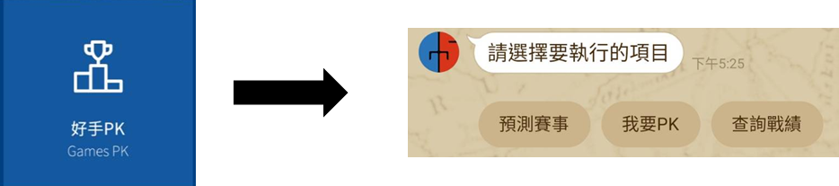

# Guess365 Line Bot 官方機器人
製作日期 : 2022/6~2023/1  
製作人 : Rick

## 功能介紹與工具:
### (一)	功能介紹
本專案將Guess365相關訊息與LINE BOT進行串接
- 加入LINE BOT即可自動註冊會員 :  
  1. 帳號密碼隨機創建，email與手機號碼預設為空(目前使用方式)  
  2. 製作小網頁，讓使用者自行註冊帳號密碼  
-	預測模型之結果與成績推播
-	各項體育賽程與賽事結果查詢
-	PK賽事即時搓合，獲勝可得相對應的G⁺幣
-	推播Guess365相關廣告
-	PK商城，兌換好禮
-	好友推薦，贈送超商禮券

### (二)	使用工具
* Python3.9.12(Jupyter Notbook)
	- datetime
	- flask
  - linebot
  - matplotlib
  - time
  - json
  - numpy
  - pandas
  - pyodbc
  - requests
-	LINE official Account Manager
-	LINE Developers
-	Aaure Data Studio
-	Ngrok

## 系統流程圖
### 一、 架構圖
架構圖顯示Linebot機器人的主要功能，及LineBot機器人與其他實體的溝通方式。  
目前系統主要功能分成:  
1. 會員資訊
2. 預測推播(手動&自動)
3. 賽果通知
4. 好手PK(隨機配對PK對手，獲勝者得G Plus幣)
5. 獲利績效(隨時查詢最新預測機器人預測結果)
6. 查詢賽況(可查詢昨、今日已開賽結果；開賽中之即時比分；今、明日未開賽之賽果)
7. 訂閱資訊(訂閱預測機器人之方法與價錢)
8. 好友推薦(推薦好友加入，填寫推薦人即可獲得超商禮券)
9. 兌換商品(GPlus幣商品兌換)
   

#### (一) 會員資訊
Line用戶點擊圖文選單「會員資訊」即可觸發快速選單，選單中有三個選項提供用戶選擇
1. 選項一為「會員中心」:會員可查訊帳密及訂閱狀況
2. 選項二為「玩法規則」:會員可查詢LINEBOT相關操作資訊
3. 選項三為「FB粉絲專業」:可連結進入Guess365 FB粉絲專業。

 

#### (二) 預測通知
1. 模型預測之賽果，透過「/UserMemberSellingPushMessage」即時推播給LINE用戶。

 

2. 管理者可透過自訂網頁「/PredictMatchPushMessage」，進行賽事手動推播(此功能僅為推播，並不會進行賣牌或預測)

 .png)

#### (三) 賽果通知
- 排程於每日上午10點透過「/immediatePredictResultsPush」推播昨日預測賽果
##### 一、 推播規則:
1. 訂閱者:每日賽果都會推送，但只有投報率為正時，「今日投報率」才會顯示
2. 非訂閱者:投報率為正時才會推播賽果，否則不推送

 

#### (四) 群體&特定會員推播
管理者可透過「/PushMessage」進行群體或特定會員訊息推播  

 

#### (五) 好手PK與戰績查詢
Line用戶點擊圖文選單「好手PK」即可觸發快速選單，選單中有三個選項提供用戶選擇
1. 選項一為「預測賽事」:可連結至Guess365官網預測頁面
2. 選項二為「我要PK」:會員可進行PK遊戲，官方將隨機配對PK對象，獲勝者可得G⁺幣
3. 選項三為「查詢戰績」:可查詢自身PK的戰況

 

 

#### (六) 查詢賽果
Line用戶點擊圖文選單「查詢賽況」即可觸發快速選單，選單中有三個選項提供用戶選擇  
1. 選項一為「昨日賽果」:可即時查詢昨日「已完賽之賽果」
2. 選項二為「今日賽事」:可查詢今日「未開賽之賠率」或「已完賽之賽果」，如「皆已開賽且未有賽事完賽」，將顯示文字「本日賽事皆開賽且尚未有任何賽果，請稍後再查詢」
3. 選項三為「明日賽事」:可查詢明日「未開賽之賠率」

 

 

 #### (七) 綁定Email信箱
自製一個小網頁，讓會員在其中填寫Email，即可獲得延長7天訂閱期限。如果在填寫期間有訂閱任一預測機器人，將自動增加該訂閱7天的期限，如未訂閱任何預測機器人，將自動增加「free」的7天訂閱期限

 

 #### (八) G Plus商城
G Plus收集到一定比例後，即可兌換相對應的商品

 

 

 

訂閱狀況 :  
0 : 兌換尚未確認  
1 : 兌換成功，但未填寫寄送資訊  
2 : 兌換成功，且以填寫寄送資訊，等待送貨  
3 : 貨已寄出  
4 : 會員按下「確認訂單」完成全部訂單流程  
5 : 兌換成功，但未在期限內填寫寄送資訊(無效訂單)  

 #### (九) 推薦好友加入
透過LINE分享功能，將LINEBOT分享給好友，當好友加入並回傳指定訊息後，雙方即可得到約定之超商禮券

 

## 二、 時序圖
### (一) 加入LineBot

 

### (二) 自動預測推播

 

### (三) 手動預測推播

 

 ### (四) 自動推播賽果
 
 

 ### (五) 會員資訊-會員中心
 
 

 ### (六) 會員中心-玩法規則
  
 

 ### (七) 會員中心-FB粉絲專頁
  
 

 ### (八) 好手PK-預測賽事
 
 

 ### (九) 好手PK-我要PK
  
 

 ### (十) 好手PK-查詢戰績
  
 

 ### (十一) 查詢賽況-昨日賽果
  
 

 ### (十二) 查詢賽況-明日賽事
   
 

 ### (十三) 查詢賽況-今日賽事
   
 

 ### (十四) 群體或特定會員推播訊息
 
 

 ### (十五) 績效查詢
 
 

 ### (十六) 即時比分
 
 

 ### (十七) PK商城

 

 ### (十八) 好友推薦
 
 

## 模組元件功能說明
### 一、 路由訪問
#### (一) 賽事推播功能
每日可透過「排程」或是「手動」的方式，將模型或人工預測的賽事結果，即時的推播給Line Bot 所有或特定的會員
1. API自動推播
- 路由 : /UserMemberSellingPushMessage
- 訪問方式 : POST
- 方法名稱 : send_UserMemberSellingPushMessage()
- 功能 : 預測模型將透過排程自動將預測結果推送給會員
- Return : 
	- 成功 : Successfully pushed to {SubscribeLevels} members.
	- 成功但所有會員都已推播過 : No {SubscribeLevels} members need to push.
	- 未訂閱的會員推播成功，但訂閱中的會員都已推播過 : no unexpired matching members need to push.
	- 推播成功，但無符合資格的會員 : Successfully pushed, but no matching members.
	- Response 400 : 錯誤訊息
2. 手動Web推播
- 路由 : /PredictMatchPushMessage
- 訪問方式 : GET/POST
- 方法名稱 : send_PredicMatchPushMessage()
- 功能 : 可手動將預測結果透過Web傳送給所有或特定會員，但此功能僅會推播，並不進行預測或賣牌

#### (二) 賽果推播
每日透過「排程」於早上10點進行前一日預測賽果推播
- 路由 : /immediatePredictResultsPush
- 訪問方式 : GET
- 方法名稱 : immediate_PredictResultsPushMessage(DateBetween = None,UserId = None)
- 功能 : 可進行選定期間內或特定會員，進行前一日LINE Bot上推播賽事之賽果
- 參數 :
	- DataBetween : 推播期間範圍(預測為昨天) ex:2023-01-01~2023-01-05 (Optional)
	- UserId : 推播會員(預測為所有會員) ex:〝U54s21a….〞 (Optional)
- Return :
	- 成功 : Successfully pushed {DatetimeTop}~{DatetimeBottom} to all member.
	- 期間內無推播任何賽事 : No Results need to push.
	- Response 400 : 錯誤訊息

#### (三) 群體或特定會員推播訊息
可透過Web進行群體或特定會員訊息推播，此功能為圖文選單訊息較為複雜時所使用，如果為普通文字、圖片或簡單的圖文選單，可直接透過Line Offical Account Manager進行群體推播，因為其可記錄相關訊息
- 路由 : /PushMessage
- 訪問方式 : GET/POST
- 方法名稱 : send_pushmessage()
- 功能 : 透過Web對所有或特定會員進行訊息推播，訊息可為「文字(Text)」或「圖文選單(FlexMessage)」

#### (四) LINE相關訊息接收與回覆
- 路由 : /PushMessage
- 訪問方式 : POST
- 方法名稱 : callback()
- 功能 : 專門用於Line Bot中相關訊息所使用
- Return :
	- 成功 : OK
	- 錯誤 : response 400
- 事件接收:
	- @handler.add(MessageEvent, message=TextMessage) : 接收文字訊息
	- @handler.add(MessageEvent, message=ImageMessage) : 接收圖片訊息
	- @handler.add(MessageEvent, message=VideoMessage : 接收影音訊息
	- @handler.add(MessageEvent, message=AudioMessage) : 接收錄音訊息
	- @handler.add(MessageEvent, message=StickerMessage) : 接收貼圖訊息
	- @handler.add(MessageEvent, message=LocationMessage) : 接收地圖訊息
	- @handler.add(PostbackEvent) : 接收Postback訊息
	- @handler.add(FollowEvent) : 接收加入LINE Bot的訊息
	- @handler.default() : 接收例外訊息，目前用於封鎖的相關訊息操作

#### (五) 訂閱信箱
- 路由 : /checkemail
- 訪問方式 : POST
- 方法名稱 : checkemail()
- 功能 : 檢查信箱，確保用戶為唯一且第一次填寫該信箱
- Return :
	- 成功 : OK
	- 錯誤 : response 400
 
#### (六) 填寫寄送資訊
- 路由 : /send_info
- 訪問方式 : GET
- 方法名稱 : seninfo()
- 功能 : 開啟自製小網頁(send_information.html)，讓使用者填寫寄送相關資訊
- Return :
	- 成功 : OK
	- 錯誤 : response 400

- 路由 : /send_check
- 訪問方式 : POST
- 方法名稱 : sendcheck()
- 功能 : 檢查使否正確填寫資訊，並將資料寫入資料庫(GPlusStore_buyer)
- Return :
	- 成功 : OK
	- 錯誤 : response 400

| 函式名稱 |  功用   |
|---------|---------|
|handle_follow(event)| 判斷加入Line Bot的會員是否已註冊過 已註冊 : 將會員修改為封鎖前的狀態 未註冊 : 自動幫會員註冊一個新會員(帳密隨機)| 
|SearchLineUser(newLineUniqueID)|判斷是否已是會員|
|alreadylogupLine(headshot,situate,newLineUniqueID)|更新會員解封鎖後的狀態|
|SaveHeadshot(headshot,UserId)|大頭照|
|RandomAccont()|隨機創建帳密|
|gen_random_string(length)|隨機長度|
|logupandfree(newLineUniqueID,UserId,headshot)|將新會員寫入DB且送15天免費訂閱|
|set_UserMemberInfo(event,UserMemberInfo)|會員資訊-會員中心的FlexMessage製作|
|manageForm(mtext)|處理透過Web註冊或登入的會員|
|get_UserMember( account=None, password=None, UserId=None)|判斷是否已是會員|
|get_LineUserMember(UserId=None,LineUniqueID=None,situate=None,member=False,maturity=False)|取得會員的相關資料|
|add_LineUserMember(UserId, newLineUniqueID,headshot,sign)|更新加入會員的狀態|
|add_freeSubscription(UserId)|贈送15天免費訂閱|
|get_LineBotAutoPredictionLog(UserId=None, SubscribeLevels=[],maturity=False, all = 0)|查詢會員訂閱狀態|
|get_GPlus(UserId)|查詢會員GPlus幣|
|get_UserMemberInfo(LineUniqueID)|查詢會員相關資訊|
|get_LineBotAutoPredictionLog(UserId,all)|修改或新增付費資訊|
|write_ReplyMessage(content, LineUniqueID)|將非關鍵字的文字訊息寫到DB中|
|write_LineBotPushMessage(type_,from_account,content,target_users)|透過API推播預測的人紀錄到DB中|
|set_FlexTemplateMaturity(contents,banner)|未訂閱者賽事預測的FlexMessage|
|set_FlexTemplateMessage(contents,header,connect,banner)|訂閱者賽事預測的FlexMessage|
|get_Quotations()|查詢DB中的下狠話|
|check_photo(teamlogos,play,team)|檢查隊徽是否存在|
|set_PlayerPKFlexTemplateMessage(event,plays)|PK賽事的FlexMessage|
|get_PlayerPKStandings(UserId, event,UserMemberInfo,other= False)|統計PK的戰績|
|SearchPKResult(event,Standings,pd_results,UserMemberInfo,other)|PK戰績的FlexMessage|
|get_PlayerPKGame()|隨機4場PK賽事|
|get_TypeCname(SportCode = None,GroupOptionCode = None)|查詢指定的賽事盤口|
|Mapping_OptionCode(OptionCode,SportCode,GroupOptionCode,HomeTeam,AwayTeam)|轉換DB中下注選項的名稱|
|add_LinePlayerPK(UserId, data, event)|添加PK賽事到DB(每日一人最多3場)|
|update_invite_LinePlayerPK(UserId, data, event)|賽事配對成功，將資料更新到DB中|
|get_member()|查詢DB中的所有會員資料|
|set_CheckFlex(data,pkid)|PK賽事確認訊息的FlexMessage|
|set_PredictResultsFlex(contents)|賽果推播的FlexMessage|
|set_PKMatchFlex(UserId,data,ToUser=1)|PK賽事配對成功的FlexMessage|
|sql_SearchLastGame(day,scope=1)|查詢指定期間的賽事類別|
|SearchMatchResult(day,sport,cname)|指定期間賽事的賽果|
|search_groupoption(sport,day)|查詢DB所有盤口|
|Searchoption(sport=False,groupoption=False,search_all=False)|查詢指定盤口賠率|
|SearchMatchEntry(day,sport,option,groupoptioncode)|查詢所有最新賽事|
|MatchEntryFlex(day,sport,cname,option,groupoption,groupoptioncode,SearchMatch)|查詢最新賽事的FlexMessage|
|manualpushsearch(evencode,option,groupoptioncode)|預測賽事的賽事資訊|
|get_UserId(account,password)|查詢會員資訊|
|get_GroupOptionName(SportCode, GroupOptionCode)|查詢賽事盤口中文名稱|
|Mapping_PredictTeamName(OptionCode,SportCode,GroupOptionCode,HomeTeam,AwayTeam)|根據DB中的option轉換成下注隊伍名稱|
|write_linepushmessage(predict,tie)|將推播賽事寫到dbo.LIENPushMatch中|
|maxid(pre)|查詢dbo.LIENPushMatch指定賽事中最新的id|
|write_linepushmember(lineid, pushid)|將推播的會員寫入dbo.LinePushMember|
|TeamNameCorrection()|查詢所有dbo.Team的資訊|
|searchalreadlypush()|查詢所有已推送過的會員|
|crop_max_square(pil_img)、crop_center(pil_img,crop_width,crop_height)、mask_circle_transparent(pil_img,blur_radius,offset=0)|方形圖轉呈圓形大頭照|
|mask_circle_transparent(pil_img,blur_radius,offset=0)|訂閱的FlexMessage|
|subscriptionlist(userinfo)|查詢所有目前的訂閱資訊|
|about_linebot(sport)|AI機器人介紹|
|performance_graph(PredictResults,sport)|機器人績效圖|
|subscribe_email()|訂閱Email|
|exchangecheck(merchandise,price,GPlus,orderId)|兌換商城確認兌換的Flexmessage|
|merchandise_status(userid,orderId)|兌換商品的訂單狀況|
|search_orderId(userId)|訂單編號查詢|

## 資料庫設計

 
