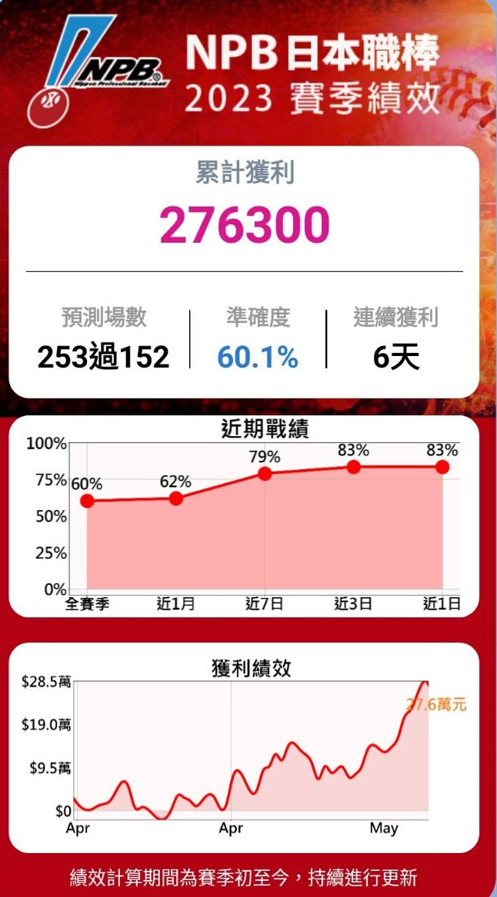
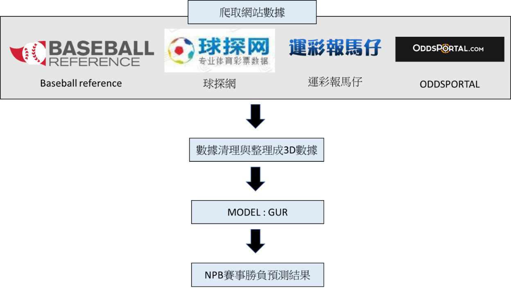

# Guess365 NPB預測機器人
製作日期 : 2023/3~2023/5  
製作人 : Rick  

## 功能介紹與工具:
### 一、	功能介紹
本專案利用大量歷史NPB(日本職業棒球聯賽)賽事數據，搭配機器學習、深度學習等方式，進行比賽勝負之預測。  
歷史資料年份 : 2012~2022賽季  
實測年份 : 2023賽季  
模型 :  GUR  
執行檔:  
-	建模程式碼 : NPB_3d建模_GUR_61%.ipynb
-	NPB_GUR_PREDICT_TO_NORMAL : 適用於前一日有比賽之賽程，開賽當日早上11點執行程式
-	NPB_GUR_PREDICT_TO_MONDAY : 適用於前一日無比賽之賽程，通常每周一無比賽，開賽當日早上11點執行程式
Excel檔:  
-	before_preddata.xlsx : 與資料庫中NPB_Date資料內容相同，但欄位名稱有些無法輸入到sql中，因此有進行名稱修改，如:
    1. -: npro ex : Away_WHIP- → Away_WHIP_npro
    2. +: pro ex : Home_k9+ → Home_k9_pro
-	SP/{sp_name}.xlsx : 先發投手的爬蟲數據(儲放在SP的資料夾中，組成方式跟預測每日時，更新先發投手數據一樣)
### 二、	使用工具與套件
-	Python3.9.12(Jupyter Notbook)
-	nest_asyncio 1.5.6
-	async-generator 1.10
-	pyppeteer  1.0.2
-	beautifulsoup4  4.12.2
-	lxml   4.9.2
-	pyquery 2.0.0
-	selenium 4.8.0
-	requests  2.29.0
-	pandas  1.5.3
-	joblib 1.1.1
-	json5   0.9.6
-	pickleshare 0.7.5
-	keras 2.8.0
-	tensorflow  2.8

## 績效
- 實際預測期間 : NPB 2023賽季(4/1~5/31)  
- 總獲利 : 276,300元(每場下注1萬元)  
- 準確度 : 60.1%



## 系統流程
### 一、	架構圖
透過爬取網路上NPB相關網站之資訊，並整理與統整數據後，組成一個3D數據集(當場比賽ID,歷史比賽ID,歷史比賽數據)，並搭配GUR模型進行賽事預測之運用。  
   


# 模組元件功能說明
## 一、	特徵值
| 特徵名稱 |  介紹   |
|---------|---------|
|主隊| 主隊名稱(數值化標籤)| 
|主隊得分| 主隊該場得分(當日以加權平均計算)| 
|客隊| 客隊名稱(數值化標籤)| 
|客隊得分| 客隊該場得分(當日以加權平均計算)| 
|Home_NextDate1| 主隊與下一戰比賽日期差(天)| 
|Home_NextLocate1| 主隊下一戰比賽位置(1:主場;2:客場)| 
|Home_NextOppo1| 主隊下一戰對手(數值化標籤)| 
|Home_NextDate2| 主隊與下二戰比賽日期差(天)| 
|Home_NextLocate2| 主隊下二戰比賽位置(1:主場;2:客場)| 
|Home_NextOppo2| 主隊下二戰對手(數值化標籤)| 
|Home_NextDate3| 主隊與下三戰比賽日期差(天)| 
|Home_NextLocate3| 主隊下三戰比賽位置(1:主場;2:客場)| 
|Home_NextOppo3| 主隊下三戰對手(數值化標籤)| 
|Away_NextDate1| 主隊與下一戰比賽日期差(天)| 
|Away_NextLocate1| 主隊下一戰比賽位置(1:主場;2:客場)| 
|Away_NextOppo1| 主隊下一戰對手(數值化標籤)| 
|Away_NextDate2| 主隊與下二戰比賽日期差(天)| 
|Away_NextLocate2| 主隊下二戰比賽位置(1:主場;2:客場)| 
|Away_NextOppo2| 主隊下二戰對手(數值化標籤)| 
|Away_NextDate3| 主隊與下三戰比賽日期差(天)| 
|Away_NextLocate3| 主隊下三戰比賽位置(1:主場;2:客場)| 
|Away_NextOppo3| 主隊下三戰對手(數值化標籤)| 
|Homeodds| 主隊賠率| 
|Awayodds| 客隊賠率| 
|Odds_return| 賠率的返還率| 
|客隊ELO| 客隊計算球隊未來比賽的勝率評分| 
|主隊ELO| 主隊計算球隊未來比賽的勝率評分| 
|year| 比賽所屬年份| 
|Both_bettle| 雙方近10場對戰主隊勝率| 
|Home_bettle| 主隊近10場勝率| 
|Away_bettle| 客隊近10場勝率| 
|Away_batting_打數| 客隊打擊打數| 
|Away_batting_得分| 客隊打擊得分 | 
|Away_batting_安打| 客隊打擊安打| 
|Away_batting_全壘打| 客隊打擊全壘打| 
|Away_batting_打點| 客隊打擊打點| 
|Away_batting_保送| 客隊打擊保送| 
|Away_batting_三振| 客隊打擊三振| 
|Away_batting_打擊| 客隊打擊打擊| 
|Away_patching_局數| 客隊投手局數| 
|Away_patching_安打| 客隊投手安打| 
|Away_patching_失分| 客隊投手失分| 
|Away_patching_責失| 客隊投手責失| 
|Away_patching_四壞| 客隊投手四壞| 
|Away_patching_三振| 客隊投手三振| 
|Away_patching_全壘打| 客隊投手被全壘打| 
|Away_patching_防禦率| 客隊投手防禦率| 
|Home_batting_打數| 主隊打擊打數| 
|Home_batting_得分| 主隊打擊得分 | 
|Home_batting_安打| 主隊打擊安打| 
|Home_batting_全壘打| 主隊打擊全壘打| 
|Home_batting_打點| 主隊打擊打點| 
|Home_batting_保送| 主隊打擊保送| 
|Home_batting_三振| 主隊打擊三振| 
|Home_batting_打擊| 主隊打擊打擊| 
|Home_patching_局數| 主隊投手局數| 
|Home_patching_安打| 主隊投手安打| 
|Home_patching_失分| 主隊投手失分| 
|Home_patching_責失| 主隊投手責失| 
|Home_patching_四壞| 主隊投手四壞| 
|Home_patching_三振| 主隊投手三振| 
|Home_patching_全壘打| 主隊投手被全壘打| 
|Home_patching_防禦率| 主隊投手防禦率| 
|Away_bullpenpatching_局數| 客隊牛棚投手局數| 
|Away_bullpenpatching_安打| 客隊牛棚投手安打| 
|Away_bullpenpatching_失分| 客隊牛棚投手失分| 
|Away_bullpenpatching_責失| 客隊牛棚投手責失| 
|Away_bullpenpatching_四壞| 客隊牛棚投手四壞| 
|Away_bullpenpatching_三振| 客隊牛棚投手三振| 
|Away_bullpenpatching_全壘打| 客隊牛棚投手被全壘打| 
|Home_bullpenpatching_局數| 主隊牛棚投手局數| 
|Home_bullpenpatching_安打| 主隊牛棚投手安打| 
|Home_bullpenpatching_失分| 主隊牛棚投手失分| 
|Home_bullpenpatching_責失| 主隊牛棚投手責失| 
|Home_bullpenpatching_四壞| 主隊牛棚投手四壞| 
|Home_bullpenpatching_三振| 主隊牛棚投手三振| 
|Home_bullpenpatching_全壘打| 主隊投牛棚手被全壘打| 
|Home_局數| 主隊先發投手局數| 
|Home_球數| 主隊先發投手球數| 
|Home_安打| 主隊先發投手安打| 
|Home_失分| 主隊先發投手失分| 
|Home_自責失分| 主隊先發投手自責失分| 
|Home_全壘打| 主隊先發投手全壘打| 
|Home_保送| 主隊先發投手保送| 
|Home_三振| 主隊先發投手三振| 
|Home_勝投| 主隊先發投手勝投| 
|Home_敗投| 主隊先發投手敗投| 
|Home_救援| 主隊先發投手救援| 
|Home_防禦率| 主隊先發投手防禦率| 
|Away_局數| 客隊先發投手局數| 
|Away_球數| 客隊先發投手球數| 
|Away_安打| 客隊先發投手安打| 
|Away_失分| 客隊先發投手失分| 
|Away_自責失分| 客隊先發投手自責失分| 
|Away_全壘打| 客隊先發投手全壘打| 
|Away_保送| 客隊先發投手保送| 
|Away_三振| 客隊先發投手三振| 
|Away_勝投| 客隊先發投手勝投| 
|Away_敗投| 客隊先發投手敗投| 
|Away_救援| 客隊先發投手救援| 
|Away_防禦率| 客隊先發投手防禦率| 
|Home_Game_InTotal| 主隊至今總場數(2012-今)| 
|Home_Win_InTotal| 主隊至今總獲勝場數(2012-今)| 
|Home_Lose_InTotal| 主隊至今總敗北場數(2012-今)| 
|Home_Tie_InTotal| 主隊至今總平手場數(2012-今)| 
|Home_WinRate_InTotal| 主隊至今總勝率(2012-今)| 
|Home_Game_InSeason| 主隊本賽季總場數| 
|Home_Win_InSeason| 主隊本賽季總獲勝場數| 
|Home_Lose_InSeason| 主隊本賽季總敗北場數| 
|Home_Tie_InSeason| 主隊本賽季總平手場數| 
|Home_WinRate_InSeason| 主隊本賽季總勝率| 
|Home_Game_inhome_InTotal| 主隊至今主場場數(2012-今)| 
|Home_Win_inhome_InTotal| 主隊至今主場獲勝場數(2012-今)| 
|Home_Lose_inhome_InTotal| 主隊至今主場敗北場數(2012-今)| 
|Home_Tie_inhome_InTotal| 主隊至今主場平手場數(2012-今)| 
|Home_WinRate_inhome_InTotal| 主隊至今主場勝率(2012-今)| 
|Home_Lose_inaway_InTotal| 主隊至今客場敗北場數(2012-今)| 
|Home_Tie_inaway_InTotal| 主隊至今客場平手場數(2012-今)| 
|Home_WinRate_inaway_InTotal| 主隊至今客場勝率(2012-今)| 
|Home_Game_inaway_InSeason| 主隊本賽季客場場數| 
|Home_Win_inaway_InSeason| 主隊本賽季客場獲勝場數| 
|Home_Lose_inaway_InSeason| 主隊本賽季客場敗北場數| 
|Home_Tie_inaway_InSeason| 主隊本賽季客場平手場數| 
|Home_WinRate_inaway_InSeason| 主隊本賽季客場勝率| 
|Away_Game_InTotal| 客隊至今總場數(2012-今)| 
|Away_Win_InTotal| 客隊至今總獲勝場數(2012-今)| 
|Away_Lose_InTotal| 客隊至今總敗北場數(2012-今)| 
|Away_Tie_InTotal| 客隊至今總平手場數(2012-今)| 
|Away_WinRate_InTotal| 客隊至今總勝率(2012-今)| 
|Away_Game_InSeason| 客隊本賽季總場數| 
|Away_Win_InSeason| 客隊本賽季總獲勝場數| 
|Away_Lose_InSeason| 客隊本賽季總敗北場數| 
|Away_Tie_InSeason| 客隊本賽季總平手場數| 
|Away_WinRate_InSeason| 客隊本賽季總勝率| 
|Away_Game_inhome_InTotal| 客隊至今主場場數(2012-今)| 
|Away_Win_inhome_InTotal| 客隊至今主場獲勝場數(2012-今)| 
|Away_Lose_inhome_InTotal| 客隊至今主場敗北場數(2012-今)| 
|Away_Tie_inhome_InTotal| 客隊至今主場平手場數(2012-今)| 
|Away_WinRate_inhome_InTotal| 客隊至今主場勝率(2012-今)| 
|Away_Lose_inaway_InTotal| 客隊至今客場敗北場數(2012-今)| 
|Away_Tie_inaway_InTotal| 客隊至今客場平手場數(2012-今)| 
|Away_WinRate_inaway_InTotal| 客隊至今客場勝率(2012-今)| 
|Away_Game_inaway_InSeason| 客隊本賽季客場場數| 
|Away_Win_inaway_InSeason| 客隊本賽季客場獲勝場數| 
|Away_Lose_inaway_InSeason| 客隊本賽季客場敗北場數| 
|Away_Tie_inaway_InSeason| 客隊本賽季客場平手場數| 
|Away_WinRate_inaway_InSeason| 客隊本賽季客場勝率| 
|Home_Rank_Total| 主隊總勝率排行| 
|Home_Rank_Season| 主隊總勝率排行| 
|Home_Rank_InHome| 主隊總主場勝率排行| 
|Home_Rank_InHome_Season| 主隊本賽季主場勝率排行| 
|Home_Rank_InAway| 主隊總客場勝率排行| 
|Home_Rank_InAway_Season| 主隊本賽季客場勝率排行| 
|Away_Rank_Total| 客隊總勝率排行| 
|Away_Rank_Season| 客隊本賽季勝率排行| 
|Away_Rank_InHome| 客隊總主場勝率排行| 
|Away_Rank_InHome_Season| 客隊本賽季主場勝率排行| 
|Away_Rank_InAway| 客隊總客場勝率排行| 
|Away_Rank_InAway_Season| 客隊本賽季客場勝率排行| 
|Home_SP_Patching_player_age_year| 主場先發投手年齡| 
|Home_SP_Patching_player_W_year| 主場先發投手年勝場| 
|Home_SP_Patching_player_L_year| 主場先發投手年敗場| 
|Home_SP_Patching_player_win_loss_perc_year| 主場先發投手年勝率| 
|Home_SP_Patching_player_earned_run_avg_year| 主場先發投手年防禦率| 
|Home_SP_Patching_player_G_year| 主場先發投手年上場數| 
|Home_SP_Patching_player_GS_year| 主場先發投手年先發場數| 
|Home_SP_Patching_player_GF_year| 主場先發投手年終結數| 
|Home_SP_Patching_player_CG_year| 主場先發投手年完投數| 
|Home_SP_Patching_player_SHO_year| 主場先發投手年完封數| 
|Home_SP_Patching_player_SV_year| 主場先發投手年救援數| 
|Home_SP_Patching_player_IP_year| 主場先發投手年投球局數| 
|Home_SP_Patching_player_H_year| 主場先發投手年被安打數| 
|Home_SP_Patching_player_R_year| 主場先發投手年被得分數| 
|Home_SP_Patching_player_ER_year| 主場先發投手年自責分| 
|Home_SP_Patching_player_HR_year| 主場先發投手年被全壘打| 
|Home_SP_Patching_player_BB_year| 主場先發投手年保送數| 
|Home_SP_Patching_player_IBB_year| 主場先發投手年故意四壞球數| 
|Home_SP_Patching_player_SO_year| 主場先發投手年三振數| 
|Home_SP_Patching_player_HBP_year| 主場先發投手年觸身球數| 
|Home_SP_Patching_player_BK_year| 主場先發投手年暴投數| 
|Home_SP_Patching_player_WP_year| 主場先發投手年狂飆球| 
|Home_SP_Patching_player_batters_faced_year| 主場先發投手年面對打數| 
|Home_SP_Patching_player_whip_year| 主場先發投手年被上壘率| 
|Home_SP_Patching_player_hits_per_nine_year| 主場先發投手年每9局被安打率| 
|Home_SP_Patching_player_bases_on_balls_per_nine_year| 主場先發投手年每9局保送率| 
|Home_SP_Patching_player_strikeouts_per_nine_year| 主場先發投手年每9局三振率| 
|Home_SP_Patching_player_strikeouts_per_base_on_balls_year| 主場先發投手年三振四壞率| 
|Away_SP_Patching_player_age_year| 客場先發投手年齡| 
|Away_SP_Patching_player_W_year| 客場先發投手年勝場| 
|Away_SP_Patching_player_L_year| 客場先發投手年敗場| 
|Away_SP_Patching_player_win_loss_perc_year| 客場先發投手年勝率| 
|Away_SP_Patching_player_earned_run_avg_year| 客場先發投手年防禦率| 
|Away_SP_Patching_player_G_year| 客場先發投手年上場數| 
|Away_SP_Patching_player_GS_year| 客場先發投手年先發場數| 
|Away_SP_Patching_player_GF_year| 客場先發投手年終結數| 
|Away_SP_Patching_player_CG_year| 客場先發投手年完投數| 
|Away_SP_Patching_player_SHO_year| 客場先發投手年完封數| 
|Away_SP_Patching_player_SV_year| 客場先發投手年救援數| 
|Away_SP_Patching_player_IP_year| 客場先發投手年投球局數| 
|Away_SP_Patching_player_H_year| 客場先發投手年被安打數| 
|Away_SP_Patching_player_R_year| 客場先發投手年被得分數| 
|Away_SP_Patching_player_ER_year| 客場先發投手年自責分| 
|Away_SP_Patching_player_HR_year| 客場先發投手年被全壘打| 
|Away_SP_Patching_player_BB_year| 客場先發投手年保送數| 
|Away_SP_Patching_player_IBB_year| 客場先發投手年故意四壞球數| 
|Away_SP_Patching_player_SO_year| 客場先發投手年三振數| 
|Away_SP_Patching_player_HBP_year| 客場先發投手年觸身球數| 
|Away_SP_Patching_player_BK_year| 客場先發投手年暴投數| 
|Away_SP_Patching_player_WP_year| 客場先發投手年狂飆球| 
|Away_SP_Patching_player_batters_faced_year| 客場先發投手年面對打數| 
|Away_SP_Patching_player_whip_year| 客場先發投手年被上壘率| 
|Away_SP_Patching_player_hits_per_nine_year| 客場先發投手年每9局被安打率| 
|Away_SP_Patching_player_bases_on_balls_per_nine_year| 客場先發投手年每9局保送率| 
|Away_SP_Patching_player_strikeouts_per_nine_year| 客場先發投手年每9局三振率| 
|Away_SP_Patching_player_strikeouts_per_base_on_balls_year| 客場先發投手年三振四壞率| 
|Home_SP| 主隊先發投手(數值化標籤)| 
|Home_SP_win| 主隊先發投手本賽季勝場數| 
|Home_SP_lose| 主隊先發投手本賽季敗場數| 
|Home_SP_ERA| 主隊先發投手本賽季防禦率| 
|Away_SP| 客隊先發投手(數值化標籤)| 
|Away_SP_win| 客隊先發投手本賽季勝場數| 
|Away_SP_lose| 客隊先發投手本賽季敗場數| 
|Away_SP_ERA| 客隊先發投手本賽季防禦率| 
|Home_Batting_age_bat_year| 主隊打者年均年齡| 
|Home_Batting_runs_per_game_year| 主隊打者年均得分| 
|Home_Batting_G_year| 主隊打者年場數| 
|Home_Batting_PA_year| 主隊打者年打擊數| 
|Home_Batting_AB_year| 主隊打者年安打數| 
|Home_Batting_R_year| 主隊打者年得分| 
|Home_Batting_H_year| 主隊打者年安打| 
|Home_Batting_2B_year| 主隊打者年2壘安打| 
|Home_Batting_3B_year| 主隊打者年3壘安打| 
|Home_Batting_HR_year| 主隊打者年全壘打| 
|Home_Batting_RBI_year| 主場先發投手年三振數| 
|Home_Batting_SB_year| 主隊打者年盜壘數| 
|Home_Batting_CS_year| 主隊打者年被刺殺數| 
|Home_Batting_BB_year| 主隊打者年保送數| 
|Home_Batting_SO_year| 主隊打者年三振數| 
|Home_Batting_batting_avg_year| 主隊打者年打擊率| 
|Home_Batting_onbase_perc_year| 主隊打者年上壘率| 
|Home_Batting_slugging_perc_year| 主隊打者年長打率| 
|Home_Batting_onbase_plus_slugging_year| 主隊打者年上壘長打率| 
|Home_Batting_TB_year| 主隊打者年壘打數|
|Home_Batting_GIDP_year| 主隊打者年滾地雙殺數| 
|Home_Batting_HBP_year| 主隊打者年觸身球數| 
|Home_Batting_SH_year| 主隊打者年犧牲打數| 
|Home_Batting_SF_year| 主隊打者年犧牲飛球數| 
|Home_Batting_IBB_year| 主隊打者年故意四壞球數| 
|Home_Patching_age_pit_year| 主隊投手年均年齡| 
|Home_Patching_runs_per_game_year| 主隊投手年均被得分| 
|Home_Patching_W_year| 主隊投手年勝場| 
|Home_Patching_L_year| 主隊投手年敗場| 
|Home_Patching_win_loss_perc_year| 主隊投手年勝率| 
|Home_Patching_earned_run_avg_year| 主隊投手年防禦率| 
|Home_Patching_run_avg_year| 主隊投手年失分| 
|Home_Patching_G_year| 主隊投手年上場數| 
|Home_Patching_GS_year| 主隊投手年先發數| 
|Home_Patching_GF_year| 主隊投手年終結數| 
|Home_Patching_CG_year| 主隊投手年完投數| 
|Home_Patching_SHO_year| 主隊投手年完封數| 
|Home_Patching_SV_year| 主隊投手年救援數| 
|Home_Patching_IP_year| 主隊投手年投球局數| 
|Home_Patching_H_year| 主隊投手年被安打數|
|Home_Patching_R_year| 主隊投手年被得分數| 
|Home_Patching_ER_year| 主隊投手年自責分| 
|Home_Patching_HR_year| 主隊投手年被全壘打數| 
|Home_Patching_BB_year| 主隊投手年四壞球數| 
|Home_Patching_IBB_year| 主隊投手年故意四壞球數| 
|Home_Patching_SO_year| 主隊投手年三振數| 
|Home_Patching_HBP_year| 主隊投手年觸身球數| 
|Home_Patching_BK_year| 主隊投手年暴投數| 
|Home_Patching_WP_year| 主隊投手年狂飆球數| 
|Home_Patching_batters_faced_year| 主隊投手年面對打數| 
|Home_Patching_whip_year| 主隊投手年被上壘率| 
|Home_Patching_hits_per_nine_year| 主隊投手年每9局被安打率| 
|Home_Patching_home_runs_per_nine_year| 主隊投手年每9局被全壘打率| 
|Home_Patching_bases_on_balls_per_nine_year| 主隊投手年每9局被保送率|
|Home_Patching_strikeouts_per_nine_year| 主隊投手年每9局被三振率| 
|Home_Patching_strikeouts_per_base_on_balls_year| 主隊投手年三振保送率|
|Home_Fielding_PO_year| 主隊守備年接殺出局數| 
|Home_Fielding_A_year| 主隊守備年助殺數| 
|Home_Fielding_E_def_year| 主隊守備年失誤數| 
|Home_Fielding_DP_def_year| 主隊守備年雙殺數| 
|Home_Fielding_fielding_perc_year| 主隊守備年防守率| 
|Home_Fielding_PB_year| 主隊守備年暴投數| 
|Away_Batting_age_bat_year| 客隊打者年均年齡| 
|Away_Batting_runs_per_game_year| 客隊打者年均得分| 
|Away_Batting_G_year| 客隊打者年場數| 
|Away_Batting_PA_year| 客隊打者年打擊數| 
|Away_Batting_AB_year| 客隊打者年安打數| 
|Away_Batting_R_year| 客隊打者年得分| 
|Away_Batting_H_year| 客隊打者年安打| 
|Away_Batting_2B_year| 客隊打者年2壘安打| 
|Away_Batting_3B_year| 客隊打者年3壘安打| 
|Away_Batting_HR_year| 客隊打者年全壘打| 
|Away_Batting_RBI_year| 客場先發投手年三振數| 
|Away_Batting_SB_year| 客隊打者年盜壘數| 
|Away_Batting_CS_year| 客隊打者年被刺殺數| 
|Away_Batting_BB_year| 客隊打者年保送數| 
|Away_Batting_SO_year| 客隊打者年三振數| 
|Away_Batting_batting_avg_year| 客隊打者年打擊率| 
|Away_Batting_onbase_perc_year| 客隊打者年上壘率| 
|Away_Batting_slugging_perc_year| 客隊打者年長打率| 
|Away_Batting_onbase_plus_slugging_year| 客隊打者年上壘長打率| 
|Away_Batting_TB_year| 客隊打者年壘打數|
|Away_Batting_GIDP_year| 客隊打者年滾地雙殺數| 
|Away_Batting_HBP_year| 客隊打者年觸身球數| 
|Away_Batting_SH_year| 客隊打者年犧牲打數| 
|Away_Batting_SF_year| 客隊打者年犧牲飛球數| 
|Away_Batting_IBB_year| 客隊打者年故意四壞球數| 
|Away_Patching_age_pit_year| 客隊投手年均年齡| 
|Away_Patching_runs_per_game_year| 客隊投手年均被得分| 
|Away_Patching_W_year| 客隊投手年勝場| 
|Away_Patching_L_year| 客隊投手年敗場| 
|Away_Patching_win_loss_perc_year| 客隊投手年勝率| 
|Away_Patching_earned_run_avg_year| 客隊投手年防禦率| 
|Away_Patching_run_avg_year| 客隊投手年失分| 
|Away_Patching_G_year| 客隊投手年上場數| 
|Away_Patching_GS_year| 客隊投手年先發數| 
|Away_Patching_GF_year| 客隊投手年終結數| 
|Away_Patching_CG_year| 客隊投手年完投數| 
|Away_Patching_SHO_year| 客隊投手年完封數| 
|Away_Patching_SV_year| 客隊投手年救援數| 
|Away_Patching_IP_year| 客隊投手年投球局數| 
|Away_Patching_H_year| 客隊投手年被安打數|
|Away_Patching_R_year| 客隊投手年被得分數| 
|Away_Patching_ER_year| 客隊投手年自責分| 
|Away_Patching_HR_year| 客隊投手年被全壘打數| 
|Away_Patching_BB_year| 客隊投手年四壞球數| 
|Away_Patching_IBB_year| 客隊投手年故意四壞球數| 
|Away_Patching_SO_year| 客隊投手年三振數| 
|Away_Patching_HBP_year| 客隊投手年觸身球數| 
|Away_Patching_BK_year| 客隊投手年暴投數| 
|Away_Patching_WP_year| 客隊投手年狂飆球數| 
|Away_Patching_batters_faced_year| 客隊投手年面對打數| 
|Away_Patching_whip_year| 客隊投手年被上壘率| 
|Away_Patching_hits_per_nine_year| 客隊投手年每9局被安打率| 
|Away_Patching_home_runs_per_nine_year| 客隊投手年每9局被全壘打率| 
|Away_Patching_bases_on_balls_per_nine_year| 客隊投手年每9局被保送率|
|Away_Patching_strikeouts_per_nine_year| 客隊投手年每9局被三振率| 
|Away_Patching_strikeouts_per_base_on_balls_year| 客隊投手年三振保送率|
|Away_Fielding_PO_year| 客隊守備年接殺出局數| 
|Away_Fielding_A_year| 客隊守備年助殺數| 
|Away_Fielding_E_def_year| 客隊守備年失誤數| 
|Away_Fielding_DP_def_year| 客隊守備年雙殺數| 
|Away_Fielding_fielding_perc_year| 客隊守備年防守率| 
|Away_Fielding_PB_year| 客隊守備年暴投數| 

|W/L| 勝負結果(1:主勝;0:客勝)| 
|ERA_avg| 近2賽季聯盟平均防禦率| 
|FIP_avg| 近2賽季聯盟平均投手表現指標| 
|WHIP_avg| 近2賽季聯盟平均被上壘率| 
|K9_avg| 近2賽季聯盟平均每9局三振率| 
|Home_patching_ERA+| 主隊投手進階防禦率| 
|Away_patching_ERA+| 客隊投手進階防禦率| 
|Home_bullpenpatching_ERA+| 主隊牛棚投手進階防禦率| 
|Away_bullpenpatching_ERA+| 客隊牛棚投手進階防禦率| 
|Home_ERA+| 主隊先發投手進階防禦率| 
|Away_ERA+| 客隊先發投手進階防禦率| 
|Home_patching_FIP-| 主隊投手進階投手表現指標| 
|Away_patching_FIP-| 客隊投手進階投手表現指標| 
|Home_bullpenpatching_FIP-| 主隊牛棚投手進階投手表現指標| 
|Away_bullpenpatching_FIP-| 客隊牛棚投手進階投手表現指標| 
|Home_FIP-| 主隊先發投手進階投手表現指標| 
|Away_FIP-| 客隊先發投手進階投手表現指標| 
|Home_patching_WHIP-| 主隊投手進階被上壘率| 
|Away_patching_WHIP-| 客隊投手進階被上壘率| 
|Home_bullpenpatching_WHIP-| 主隊牛棚投手進階被上壘率|
|Away_bullpenpatching_WHIP-| 客隊牛棚投手進階被上壘率| 
|Home_WHIP-| 主隊先發投手進階被上壘率| 
|Away_WHIP-| 客隊先發投手進階被上壘率| 
|Home_patching_k9+| 主隊投手進階每9局三振率| 
|Away_patching_k9+| 客隊投手進階每9局三振率| 
|Home_bullpenpatching_k9+| 主隊牛棚投手進階每9局三振率| 
|Away_bullpenpatching_k9+| 客隊牛棚投手進階每9局三振率| 
|Home_k9+| 主隊先發投手進階每9局三振率| 
|Away_k9+| 客隊先發投手進階每9局三振率| 

## 二、	自訂函式
### 1.	函數名稱 : MyLabelEncoder()
-	參數 : LabelEncoder – 要轉換的先發投手名稱
-	函數功能 : 將先發投手進行數值化轉換，但為了避免因為新增加的投手造成數值轉換改變，因此自訂一個函數使用
### 2.	函數名稱 : crawler_titan()
-	函數功能 : 抓取球探網每場賽事的賽程
-	儲存檔 : /sch.xlsx
### 3.	函數名稱 : titain_data()
-	參數 : df_sch – crawler_titan ()中抓取的賽程
-	函數功能 : 抓取球探網的每場賽事基本數據
-	儲存檔 : /titan.xlsx
-	注意事項 : callurl_and_getdata()中start_parm中executablePath更改為chrome.exe的檔案位置
### 4.	函數名稱 : crawler_lottonavi()
-	參數 : df_sch - crawler_titan ()中抓取的賽程
-	函數功能 : 抓取運彩報馬仔每場賽事的基本數據
-	儲存檔 : /odds_sch.xlsx
-	注意事項 : callurl_and_getdata()中start_parm中executablePath更改為chrome.exe的檔案位置	
### 5.	函數名稱 : SP_update()
-	參數 : df_lottonavi - crawler_lottonavi ()中抓取的賽事
-	函數功能 : 比對並合併最新賽事的先發投手數據
-	儲存檔 : /sp_data.xlsx
### 6.	函數名稱 : SP_data()
-	參數 : df_lottonavi - crawler_lottonavi ()中抓取的賽事
-	函數功能 : 抓取球探網每場賽事的各家莊家平均不讓分賠率
-	儲存檔 : /odds_all.xlsx
-	注意事項 : callurl_and_getdata()中start_parm中executablePath更改為chrome.exe的檔案位置
### 7.	函數名稱 : pitcher_data()
-	參數 : df_base_and_sp – 球探網與運彩報馬仔最新賽事數據
-	函數功能 : 抓取運彩報馬仔最新已完賽事之數據
-	儲存檔 : /boxscore_all.xlsx
-	注意事項 : callurl_and_getdata()中start_parm中executablePath更改為chrome.exe的檔案位置
### 8.	函數名稱 : oddsportal_href()
-	函數功能 : 抓取oddsportal網站中的賽事賽程
-	注意事項 : 該網站的class可能會不定期變更，所以需要注意變更時需要修改
### 9.	函數名稱 : oddsportal_odds_before()
-	參數 : df_href - oddsportal_href()中抓取的oddsportal賽程網址
-	函數功能 : 抓取oddsportal中最新已完賽的賠率
-	儲存檔 : /odds.xlsx
-	注意事項 : callurl_and_getdata()中start_parm中executablePath更改為chrome.exe的檔案位置
### 10.	函數名稱 : oddsportal_odds()
-	參數 : df_href – oddsportal_href()中抓取的oddsportal賽程網址
-	函數功能 : 抓取oddsportal中最新未開賽的賠率
-	儲存檔 : /odds_now.xlsx
-	注意事項 : callurl_and_getdata()中start_parm中executablePath更改為chrome.exe的檔案位置
### 11.	函數名稱 : update_winrate()
-	參數 : all_sch – npb歷史賽事賽程
-	函數功能 : 計算球隊整體與該賽季勝率
-	儲存檔 : /球隊名稱.xlsx
### 12.	函數名稱 : winrateate_data()
-	參數 : df_base_and_sp3 –最新賽事數據
-	函數功能 : 合併計算的最新球隊勝率到最新賽事數據中
-	儲存檔 : /player_game/各球員的xlsx檔
-	注意事項 : callurl_and_getdata()中start_parm中executablePath更改為chrome.exe的檔案位置
### 13.	函數名稱 : rank()
-	參數 : df_base_and_sp4 –最新賽事數據
-	函數功能 : 計算根據勝率進行球隊排行
-	儲存檔 : /rank.xlsx
### 14.	函數名稱 : elo()
-	參數 : df_base_and_sp5 -最新賽事數據
-	函數功能 : 計算最新賽事的ELO
-	儲存檔 : /data_base_sp_elo.xlsx
### 15.	函數名稱 : argumentvanced_data()
-	參數 : boxscore_all - pitcher_data()中抓取並整理的數據  
        df_yesterday – elo()中統整的歷史數據
-	函數功能 : 計算進階數據
### 16.	函數名稱 : reference_pitcher_year()
-	函數功能 : 抓取baseball reference中NPB的年資料網址
-	儲存檔 : / team_years.xlsx
### 17.	函數名稱 : reference_pitcherer_year_data()
-	參數 : df_all – reference_pitcher_year()中抓取的年資料網址
-	函數功能 : 抓取球隊打擊與投手的年資料
-	儲存檔 : /batting_year.xlsx  
          /pitching_year.xlsx
### 18.	函數名稱 : chinese_sp_connect()
-	參數 : sp_all – 先發投手數據
-	函數功能 : 抓取運彩報馬仔中先發投手隸屬球隊，與生日(比較好比對英文名稱的方式)
-	儲存檔 : /sp_bir.xlsx
### 19.	函數名稱 : english_sp_connect()
-	參數 : pitching_player_df – reference_pitcherer_year_data()中抓取的投手年資料
-	函數功能 : 抓取baseball reference中先發投手隸屬球隊，與生日(比較好比對中文名稱的方式)
-	儲存檔 : /sp_bir_reference.xlsx
### 20.	函數名稱 : sp_year_data()
-	參數 : df11 – 最新賽事數據  
         pitcher_year – 投手中英文合併數據
-	函數功能 : 合併先發投手年資料到最新賽事中
-	儲存檔 : /sp_data_y.xlsx
### 21.	函數名稱 : years_data()
-	參數 : df10 – 最新賽事數據
-	函數功能 : 合併球隊年資料到最新賽事中
-	儲存檔 : /base_data_y.xlsx
### 22.	函數名稱 : before10_data()
-	參數 : df13 – 最新賽事數據  
         df14 – 歷史賽事數據
-	函數功能 : 為了轉變成3d數據做前處理，將每筆最新賽事的前10比數據取出
-	儲存檔 : /base_predata_2.xlsx
### 23.	函數名稱 : data_fill()
-	參數 : merged_df – 最新賽事數據
-	函數功能 : 點補缺值，以歷史資料的加權平均做計算，如無資料則以0做填補
-	儲存檔 : /fill_to_predictdata_v3.xlsx
## 三、	自訂模組
### 1.	模組名稱 : gru_sp_name.pkl
-	模組介紹 : 先發投手的名稱數值轉換
-	注意事項 : 搭配自訂的class「MyLabelEncoder(LabelEncoder)」，以避免有新的先發投手出現，造成原數值轉換對應錯誤
### 2.	模組名稱 : gru_team_name.pkl
-	模組介紹 : 求隊名稱數值轉換
### 3.	模組名稱 : gru_minmaxscaler.pkl
-	模組介紹 : 原train特徵數據的最大最小值
### 4.	模組名稱 : gru_61_model.h5
-	模組介紹 : 用GRU模型進行預測
-	自訂loss: 
```python
import tensorflow.keras.backend as K
import tensorflow as tf
	
def balanced_binary_crossentropy(y_true, y_pred, pos_weight=1, epsilon=1e-7):
    """
    pos_weight: 正樣本權重，默認為1
    epsilon: 避免除以0，默認為1e-7
    """
    # 將y_true轉換為float32，以便與y_pred進行相乘
    y_true = tf.cast(y_true, tf.float32)
    # 計算損失
    loss = -(pos_weight * y_true * K.log(y_pred + epsilon) + (1 - y_true) * K.log(1 - y_pred + epsilon))
    return K.mean(loss)
```
-	自訂f1-score:
```python
def f1_score(y_true, y_pred):
    y_true = K.round(y_true)
    y_pred = K.round(y_pred)
    tp = K.sum(K.cast(y_true * y_pred, 'float'), axis=0)
    fp = K.sum(K.cast((1 - y_true) * y_pred, 'float'), axis=0)
    fn = K.sum(K.cast(y_true * (1 - y_pred), 'float'), axis=0)
    precision = tp / (tp + fp + K.epsilon())
    recall = tp / (tp + fn + K.epsilon())
    f1_score = 2 * precision * recall / (precision + recall + K.epsilon())
    return K.mean(f1_score)
```
-	GUR程式碼: 
```python
# 建立模型
model = Sequential()
model.add(GRU(64, input_shape=(x_train2.shape[1],x_train2.shape[2]), recurrent_regularizer=l1_l2(0.01), return_sequences=True))
model.add(Dropout(0.3))
model.add(BatchNormalization())
model.add(GRU(32, activation=LeakyReLU(), return_sequences=True, recurrent_regularizer=l1_l2(0.01)))
model.add(Dropout(0.3))
model.add(BatchNormalization())
model.add(GRU(16, activation=LeakyReLU(), return_sequences=False, recurrent_regularizer=l1_l2(0.01)))
model.add(Dropout(0.3))
model.add(BatchNormalization())
model.add(Dense(1, activation='sigmoid'))

# 定義優化器，設置閾值初始值
optimizer =  Nadam(lr=0.001)
	
# 編譯模型
model.compile(loss=lambda y_true, y_pred: balanced_binary_crossentropy(y_true, y_pred, pos_weight=0.85),optimizer=optimizer, metrics=['accuracy', Precision(),Recall(),f1_score, AUC()])

# 定義EarlyStopping
earlystop = EarlyStopping(monitor='val_loss', min_delta=0, patience=6, verbose=1, mode='auto')
reduce_lr = ReduceLROnPlateau(monitor='val_loss', factor=0.1, patience=3, verbose=1)

# 訓練模型
history = model.fit(x_train2.astype('float32'), y_train, epochs=100, batch_size=16, validation_data=(x_val2.astype('float32'),y_val), callbacks=[earlystop, reduce_lr],verbose=1)
```

## 四、	預測API 
```python
rl =f'https://{self.domain_name}/UserMemberSellingPushMessage'
      json_= {"SubscribeLevels":"free/NPB/VIP",     *推送等級
              "predict_winrate":"58.7%",
             "title":"本季準確度 : ",
             "body_data":"2021賽季回測|39050|852過500|58.7%",
             "TournamentText_icon":"https://i.imgur.com/4YeALVb.jpeg",
             "body_image":"https://i.imgur.com/w4MQwdZ.png",
             "predlist":predlist,
             "connect":False,
             "banner":"NPB",
             "check":False}
response = requests.post(url, json = json_, auth=HTTPBasicAuth('rick', '123rick456'), verify=False

predlist = [{'account':"",   *預測者帳號
              'password':"",  *預測者密碼
               'GroupOptionCode':20,   *預測盤口
               'OptionCode':int(OptionCode),  *預測方向
               'EventCode':EventCode,   *賽事Eventcode
               'predict_type':'Selling',     *預測種類
               'HomeOdds':float(HomeOdds),     *主隊賠率
               'AwayOdds':float(AwayOdds),       *客隊賠率
               'HomeConfidence':str(int(round( (pre[i]) * 100,0))) + "%",     *主隊信心度
               'AwayConfidence':str(int(round((1-pre[i]) * 100,0))) + "%",    *客隊信心度
               'main' : main     *是否為主推(NPB主推為85%以上)
}]    
```
